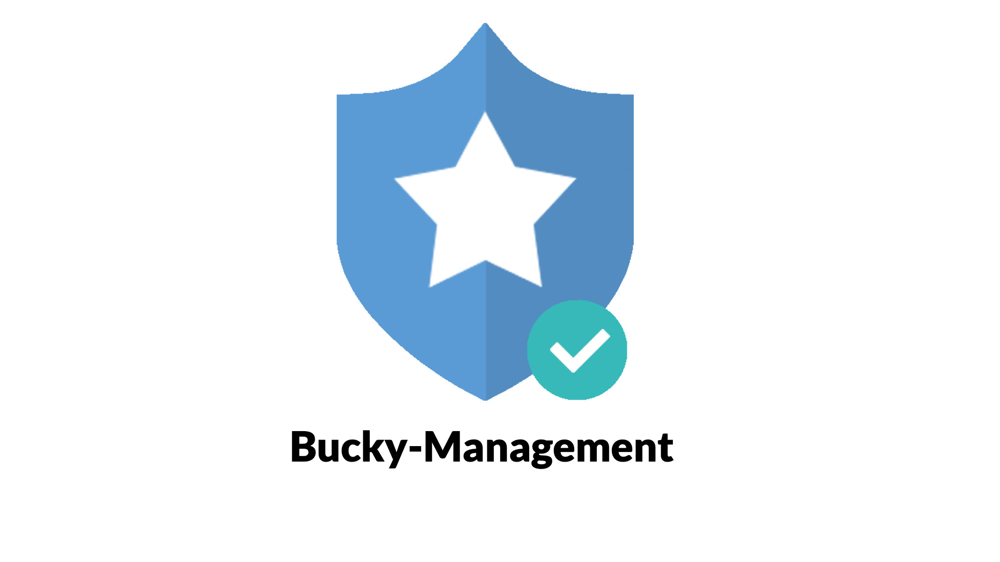

# Bucky-Management

[](https://codeclimate.com/github/lifull-dev/bucky-management/maintainability)

## Overview
Bucky-management is a web application that shows test result executed by [Bucky-core](https://github.com/lifull-dev/bucky-core).

## Getting Started
We prepare three docker-compose files to start up Bucky-managemnt.
- **docker-compose.yml**: Base compose file for production
- **docker-compose.with_mysql.yml**: Compose file for adding a DB container
- **docker-compose.dev.yml**: Compose file for development

## Starting in production environment
### Set environment variables
Set DB name if you start Bucky-management first time:
```bash
export BUCKY_DB_NAME=${BUCKY_DB_NAME}

# Set connecting info for external DB.
# Ignore these if you are going to use mysql container.
export BUCKY_DB_USERNAME=${BUCKY_DB_USERNAME}
export BUCKY_DB_PASSWORD=${BUCKY_DB_PASSWORD}
export BUCKY_DB_HOSTNAME=${BUCKY_DB_HOSTNAME}
```

### Build and start Bucky-management
```bash
# Start only Bucky-management. (Make sure you have prepared an external DB)
docker-compose up --build -d

# Start with mysql DB container
docker-compose -f docker-compose.yml -f docker-compose.with_mysql.yml up --build -d
```

### Migration database and table
```bash
# Create DB if you start Bucky-management first time.
docker exec -it bm-app rails db:create
# Do this if new migration file is added.
docker exec -it bm-app rails db:migrate
```
### Publish secret key base and set to environment variables
```bash
export SECRET_KEY_BASE=$(docker exec -it bm-app rake secret)

# Restart Bucky-management to reflect environment variables
docker-compose up --build -d
# Restart with mysql DB container
docker-compose -f docker-compose.yml -f docker-compose.with_mysql.yml up --build -d
```

## Starting in development environment

### Build and start Bucky-management
```bash
# Start Bucky-management in development with mysql DB container
docker-compose -f docker-compose.yml -f docker-compose.dev.yml -f docker-compose.with_mysql.yml up --build -d
```

### Migration database and table
```bash
# Create DB if you start Bucky-management first time.
docker exec -it bm-app rails db:create
# Do this if new migration file is added.
docker exec -it bm-app rails db:migrate
```

## Check your Bucky-management dashboard
http://localhost
